# Notification Service

> Event-driven notification & transactional email microservice for the ASKO repair-management platform.

`notification-service` is the single source of truth for user-facing notifications. It consumes domain events from every other service over RabbitMQ, persists notifications to its own PostgreSQL database, pushes real-time deliveries through a Redis pub/sub channel, and dispatches transactional emails through a BullMQ-backed SMTP worker.

---

## Table of Contents

1. [At a Glance](#1-at-a-glance)
2. [High-Level Architecture](#2-high-level-architecture)
3. [Component Model](#3-component-model)
4. [Data Model](#4-data-model)
5. [Public API (gRPC)](#5-public-api-grpc)
6. [Event Consumers](#6-event-consumers)
7. [Notification Lifecycle](#7-notification-lifecycle)
8. [Real-Time Push Pipeline](#8-real-time-push-pipeline)
9. [Email Pipeline (BullMQ)](#9-email-pipeline-bullmq)
10. [Reminder Watchdog](#10-reminder-watchdog)
11. [Deployment Topology](#11-deployment-topology)
12. [Configuration](#12-configuration)
13. [Error Model](#13-error-model)
14. [Observability](#14-observability)
15. [Notification & Target Type Catalog](#15-notification--target-type-catalog)
16. [Releases](#16-releases)

---

## 1. At a Glance

| Attribute        | Value                                                    |
|------------------|----------------------------------------------------------|
| Package          | `@asko/notification-service`                             |
| gRPC port        | `GRPC_PORT` (default **5004**)                           |
| Metrics port     | `METRICS_PORT` (default **9104**)                        |
| Database         | PostgreSQL — `asko_rws_notify_db`                        |
| Transports in    | gRPC (NestJS microservice) + RabbitMQ (`notification_queue`) |
| Transports out   | RabbitMQ (`chat_queue`), Redis Pub/Sub, SMTP (nodemailer), gRPC → user-service |
| Job queue        | BullMQ over Redis — queue name `email`                   |
| ORM              | MikroORM v6 (PostgreSQL driver)                          |
| Framework        | NestJS 11 (ESM, ES2022, TypeScript strict)               |

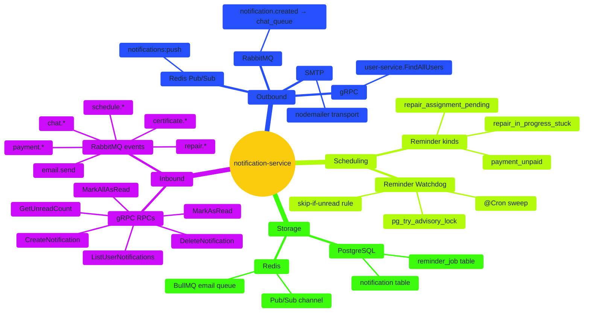

---

## 2. High-Level Architecture

The service sits behind the realtime-gateway for read/write RPCs and consumes events from every other domain service. Nothing calls its database directly — all interactions go through gRPC or RMQ.

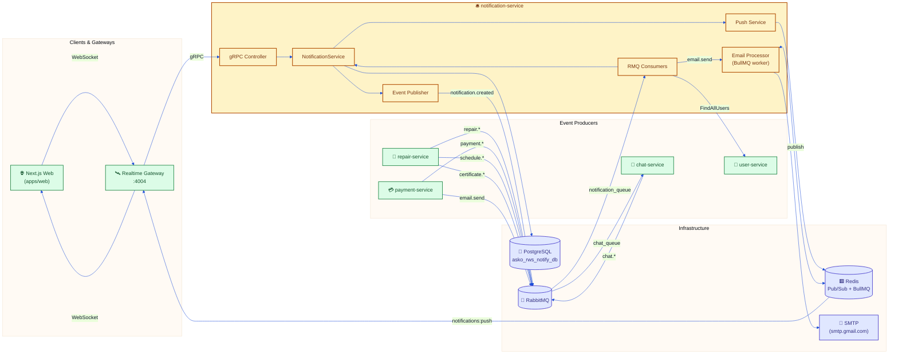

---

## 3. Component Model

Internal NestJS modules and their dependencies.

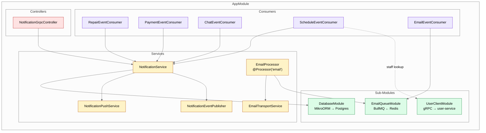

### Class Diagram — Service Layer

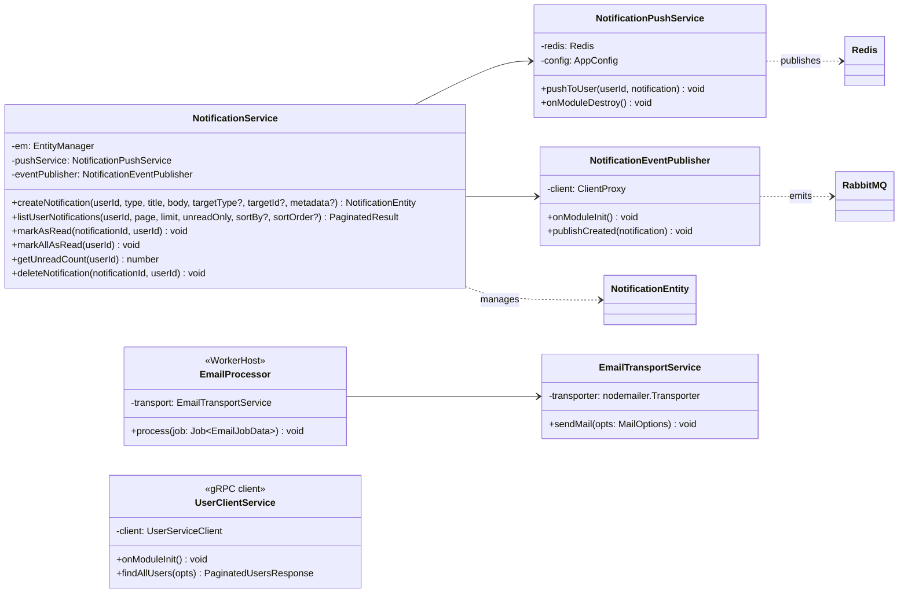

---

## 4. Data Model

### ER Diagram

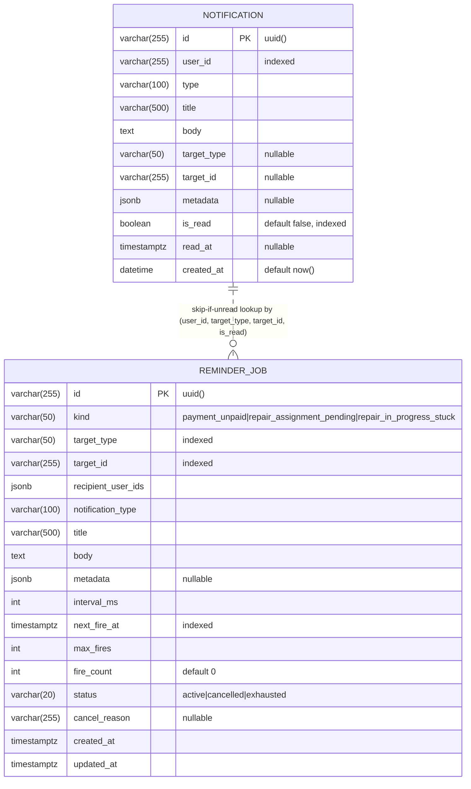

- No foreign keys — `user_id`, `target_id`, `recipient_user_ids[]` are soft references owned by other services.
- `notification` indexes: `id`, `user_id`, `is_read`, and a composite `(target_type, target_id, is_read)` index (`idx_notification_target_unread`) that backs `ReminderService.hasUnreadForTarget()`.
- `reminder_job` indexes:
  - `idx_reminder_job_sweep` on `(status, next_fire_at)` — the hot path for the sweep query.
  - `idx_reminder_job_target` on `(target_type, target_id, status)` — supports `cancelReminder()`.
  - `idx_reminder_job_kind_target` on `(kind, target_type, target_id, status)` — supports dedupe in `scheduleReminder()`.
- `metadata` is free-form JSONB — consumers shape it per notification type (e.g. `{ messageId, senderId, conversationId, messageType }` for chat, `{ paymentId, amount, currency }` for reminders).
- The `NOTIFICATION ||..o{ REMINDER_JOB` line is *not* a DB relation — it's the logical join the sweep performs at fire time to implement the skip-if-unread rule.

### State Machine — Single Notification

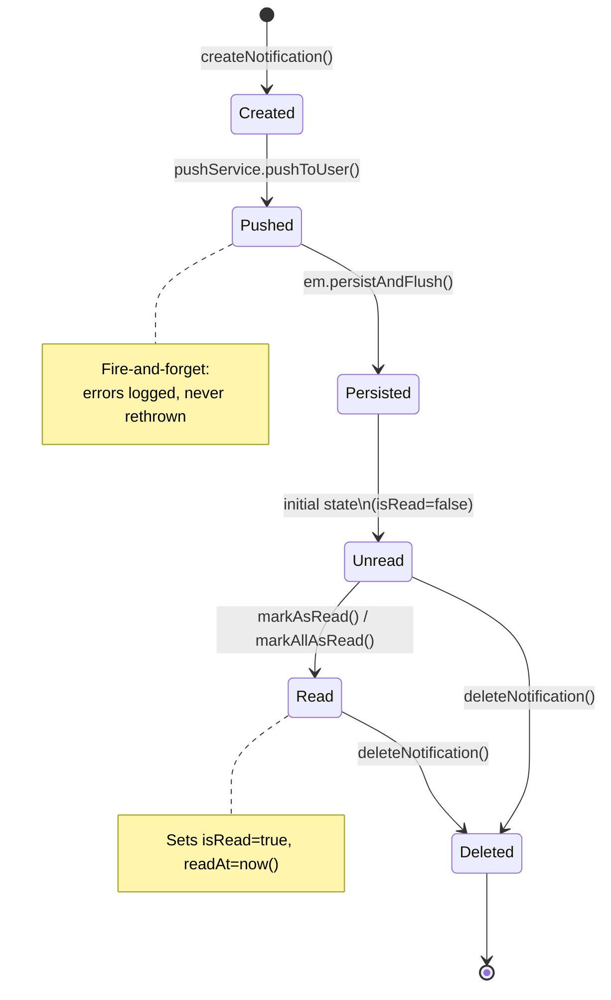

---

## 5. Public API (gRPC)

Proto package: `notification` (source: `packages/proto/notification.proto`).
Controller: `src/controllers/notification.grpc.controller.ts`.

| RPC                     | Request                        | Response                        | Purpose                                  |
|-------------------------|--------------------------------|---------------------------------|------------------------------------------|
| `CreateNotification`    | `CreateNotificationRequest`    | `NotificationResponse`          | Create a notification for a user         |
| `ListUserNotifications` | `ListUserNotificationsRequest` | `PaginatedNotificationsResponse`| Paginated list, optional `unreadOnly`    |
| `MarkAsRead`            | `MarkAsReadRequest`            | `EmptyNotificationResponse`     | Flip a single notification to read       |
| `MarkAllAsRead`         | `MarkAllAsReadRequest`         | `EmptyNotificationResponse`     | Bulk mark all unread → read              |
| `GetUnreadCount`        | `GetUnreadCountRequest`        | `UnreadCountResponse`           | Count `isRead=false` for a user          |
| `DeleteNotification`    | `DeleteNotificationRequest`    | `EmptyNotificationResponse`     | Remove a single notification             |

### Error Mapping

`AppError.httpStatus` is mapped to gRPC status codes via `toGrpcError()`:

| HTTP | gRPC                    |
|------|-------------------------|
| 400  | `INVALID_ARGUMENT`      |
| 401  | `UNAUTHENTICATED`       |
| 403  | `PERMISSION_DENIED`     |
| 404  | `NOT_FOUND`             |
| 409  | `ALREADY_EXISTS`        |
| *    | `INTERNAL`              |

---

## 6. Event Consumers

Every consumer listens on the durable `notification_queue`, uses `@EventPattern()` to match a routing key, and **always ACKs** after handling (no DLQ). Payment and repair consumers additionally **schedule or cancel `ReminderJob` rows** on state transitions — see §10 for the full watchdog model.

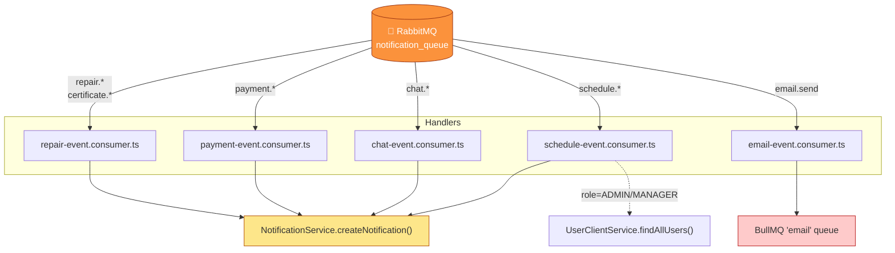

### Routing Key → Notification Type

| Source           | Routing key                    | Notification `type`                           | Target             |
|------------------|--------------------------------|-----------------------------------------------|--------------------|
| repair-service   | `repair.status_changed`        | `REPAIR_STATUS_CHANGED`                       | `REPAIR_REQUEST`   |
| repair-service   | `repair.assigned`              | `REPAIR_ASSIGNED`                             | `REPAIR_REQUEST`   |
| repair-service   | `repair.completed`             | `REPAIR_COMPLETED`                            | `REPAIR_REQUEST`   |
| repair-service   | `repair.transferred`           | `REPAIR_TRANSFERRED_*` (up to 3)              | `REPAIR_REQUEST`   |
| repair-service   | `repair.diagnostics_declined`  | `REPAIR_DIAGNOSTICS_DECLINED`                 | `REPAIR_REQUEST`   |
| repair-service   | `certificate.expiring_soon`    | `CERTIFICATE_EXPIRING_SOON`                   | `CERTIFICATE`      |
| repair-service   | `certificate.expired`          | `CERTIFICATE_EXPIRED`                         | `CERTIFICATE`      |
| payment-service  | `payment.created`              | `INVOICE_CREATED`                             | `PAYMENT`          |
| payment-service  | `payment.paid`                 | `PAYMENT_PAID`                                | `PAYMENT`          |
| payment-service  | `payment.failed`               | `PAYMENT_FAILED`                              | `PAYMENT`          |
| payment-service  | `payment.refunded`             | `PAYMENT_REFUNDED`                            | `PAYMENT`          |
| chat-service     | `chat.message`                 | `CHAT_MESSAGE` (fan-out to `recipientIds[]`)  | `CONVERSATION`     |
| chat-service     | `chat.conversation_created`    | `CHAT_CONVERSATION_CREATED`                   | `CONVERSATION`     |
| chat-service     | `chat.participant_added`       | `CHAT_PARTICIPANT_ADDED`                      | `CONVERSATION`     |
| chat-service     | `chat.participant_removed`     | `CHAT_PARTICIPANT_REMOVED`                    | `CONVERSATION`     |
| repair-service   | `schedule.created`             | `SCHEDULE_CREATED` / `SCHEDULE_EXTRA_DAY_REQUESTED` | `SCHEDULE`   |
| repair-service   | `schedule.approved`            | `SCHEDULE_APPROVED` / `*_EXTRA_DAY_ACCEPTED`  | `SCHEDULE`         |
| repair-service   | `schedule.rejected`            | `SCHEDULE_REJECTED` / `*_EXTRA_DAY_REJECTED`  | `SCHEDULE`         |
| repair-service   | `schedule.updated`             | `SCHEDULE_UPDATED`                            | `SCHEDULE`         |
| repair-service   | `schedule.deleted`             | `SCHEDULE_DELETED`                            | `SCHEDULE`         |
| repair-service   | `schedule.pattern_*`           | `SCHEDULE_PATTERN_*`                          | `SCHEDULE`         |
| any              | `email.send`                   | *(enqueued as BullMQ job, not a notification)*| —                  |

### Reminder hooks inside consumers

| Routing key                    | Reminder action                                                                                                       |
|--------------------------------|-----------------------------------------------------------------------------------------------------------------------|
| `payment.created`              | **Schedule** `payment_unpaid` reminder (interval+max from config)                                                     |
| `payment.paid` / `.failed` / `.refunded` | **Cancel** `payment_unpaid` reminder with reason `payment.<event>`                                         |
| `repair.assigned`              | **Schedule** `repair_assignment_pending` reminder for `repairerUserId`                                                |
| `repair.status_changed`        | `oldStatus=assigned` → cancel `repair_assignment_pending`; `newStatus=in_progress` → schedule `repair_in_progress_stuck` (repairer + staff fan-out); `oldStatus=in_progress` → cancel `repair_in_progress_stuck` |
| `repair.transferred`           | **Cancel** existing `repair_assignment_pending` and **schedule** a fresh one for `newRepairerUserId`                  |
| `repair.completed`             | **Cancel** both `repair_assignment_pending` and `repair_in_progress_stuck`                                            |

### Schedule actor logic (simplified)

Schedule events have the richest branching because a single routing key can target either the repairer or the office staff depending on who acted.

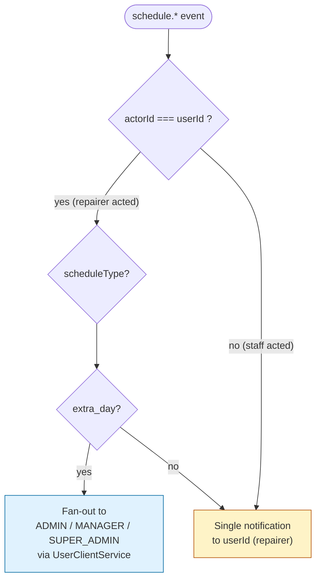

---

## 7. Notification Lifecycle

### Sequence — domain event → persisted & delivered notification

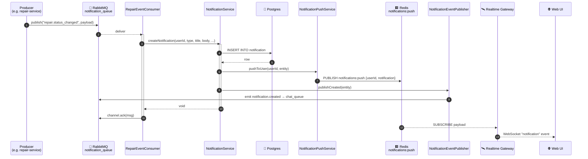

### Sequence — client marks as read

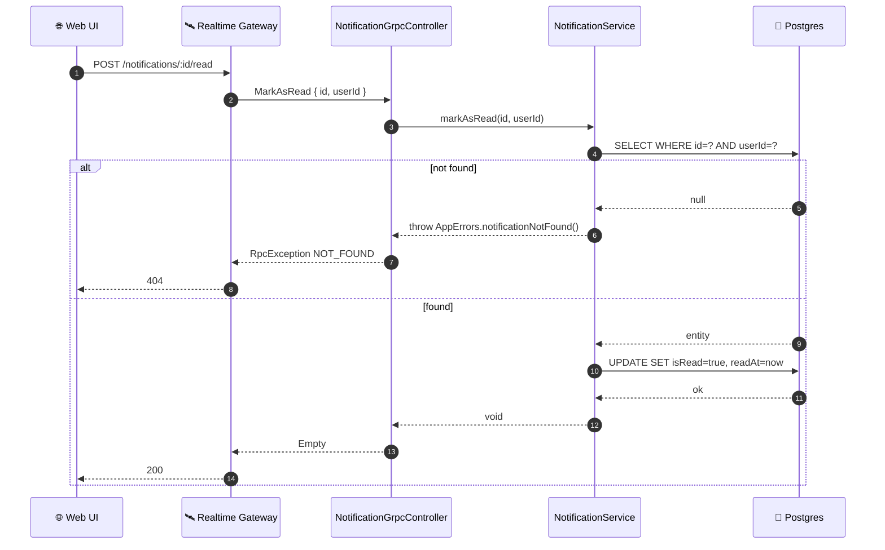

---

## 8. Real-Time Push Pipeline

The service never talks to WebSocket clients directly. It drops a JSON payload on a Redis pub/sub channel and the realtime-gateway (which owns socket state) fans it out to the right sockets.

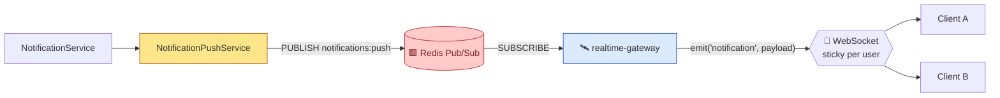

Payload shape:

```json
{
  "userId": "uuid",
  "notification": { "id": "...", "type": "...", "title": "...", "body": "...", "..." : "..." }
}
```

Errors are caught and logged — a Redis outage will not break notification creation.

---

## 9. Email Pipeline (BullMQ)

A dedicated RMQ → BullMQ bridge decouples the transactional email fan-in from the SMTP dispatch, giving us retries, priority, and backpressure.

### Activity flow

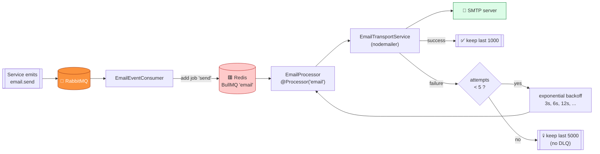

### Job shape — `EmailJobData`

```ts
interface EmailJobData {
  to: string;
  from: string;
  subject: string;
  text: string;
  html: string;        // pre-rendered — no server-side templating
  metadata?: {
    type?: string;     // e.g. "invoice", "reset_password"
    userId?: string;
    priority?: number; // BullMQ priority, default 5
  };
}
```

Queue options (set by `email-event.consumer.ts` when calling `queue.add('send', ...)`):

| Option                      | Value                   |
|----------------------------|-------------------------|
| `attempts`                  | `5`                     |
| `backoff`                   | `{ type: 'exponential', delay: 3000 }` |
| `removeOnComplete`          | `1000`                  |
| `removeOnFail`              | `5000`                  |
| `priority`                  | `data.metadata?.priority ?? 5` |

> HTML is expected to be pre-rendered upstream. `notification-service` is a transport, not a template engine.

---

## 10. Reminder Watchdog

A persistent, cron-swept scheduler that **re-fires a notification after a delay when the target action is still pending** — and stops as soon as the action transitions to a terminal state. Lives entirely inside `notification-service`; no new RPC surface, no callbacks from other services.

### Why it exists

| Case                            | What should happen                                                                                                    |
|---------------------------------|-----------------------------------------------------------------------------------------------------------------------|
| Invoice never paid              | Re-notify the customer every 30 min, up to 3 times, until `payment.paid/failed/refunded` arrives.                     |
| Repairer ignores an assignment  | Re-notify the repairer every 15 min, up to 3 times, until they leave `ASSIGNED`.                                      |
| Repair stuck in `IN_PROGRESS`   | 8 h after entering `IN_PROGRESS`, fire **once** to the repairer **and** all `ADMIN` / `MANAGER` / `SUPER_ADMIN` staff. |

**Hard rule:** before firing a scheduled reminder, skip this round for any recipient that already has an **unread** prior notification for the same `(userId, targetType, targetId)`. We only nag once the user has actually *seen* and ignored the previous reminder — no unread stacking.

### Component Model

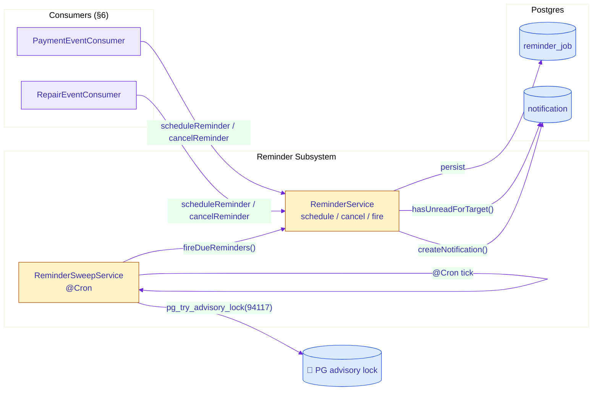

### ReminderJob state machine

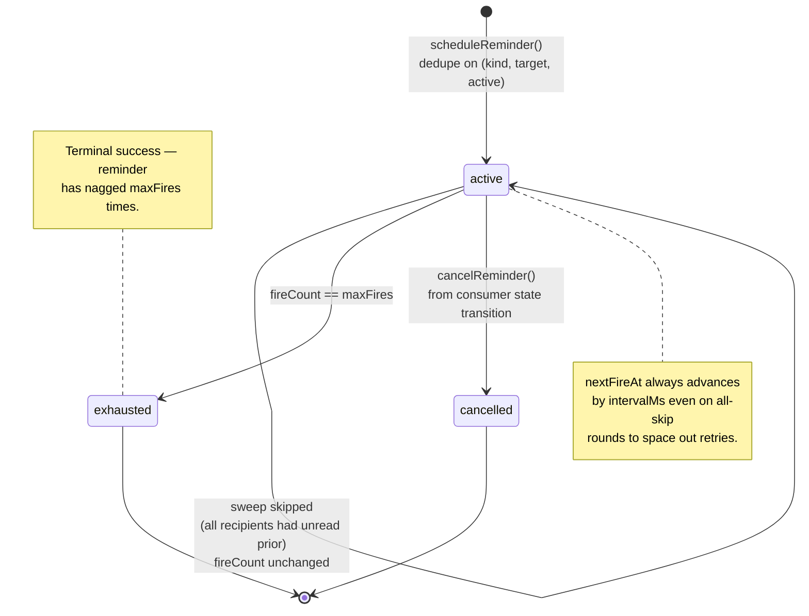

### Sweep algorithm

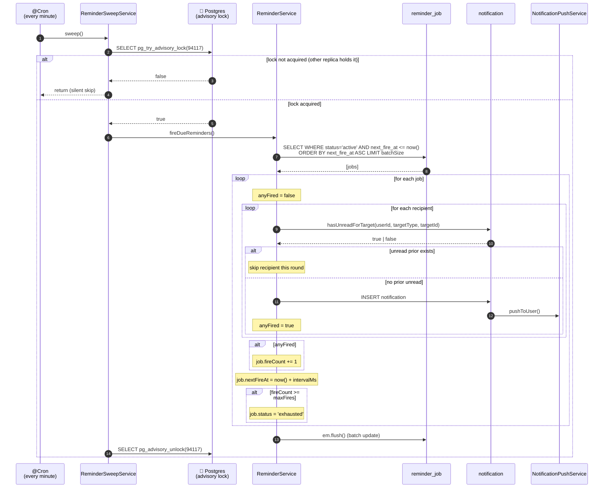

### Skip-if-unread decision

```mermaid
flowchart TD
    Start(["fire job for recipient"])
    Check{Unread prior<br/>for (userId,<br/>targetType,<br/>targetId) ?}
    Skip["Skip this recipient<br/>(log: unread prior exists)"]
    Fire["createNotification()<br/>metadata.reminderAttempt = fireCount + 1"]
    Mark{"anyFired<br/>across recipients ?"}
    Bump["fireCount += 1"]
    Keep["fireCount unchanged"]
    Advance["nextFireAt = now() + intervalMs"]
    Exhaust{"fireCount &gt;= maxFires ?"}
    Done["status = exhausted"]
    Loop["status stays active"]

    Start --> Check
    Check -- yes --> Skip --> Mark
    Check -- no --> Fire --> Mark
    Mark -- yes --> Bump --> Advance
    Mark -- no --> Keep --> Advance
    Advance --> Exhaust
    Exhaust -- yes --> Done
    Exhaust -- no --> Loop

    style Skip fill:#fef3c7,stroke:#b45309
    style Fire fill:#dcfce7,stroke:#15803d
    style Done fill:#fecaca,stroke:#b91c1c
```

**Consequence:** a reminder that keeps getting skipped because the user never reads it will *not* run out of fires — it re-tries indefinitely until the user either reads and ignores the previous copy (triggering a real fire) or a terminal event arrives. That matches the intent: we only nag once the user has seen and dismissed the last notification.

### Reminder kinds

| Kind                           | Target            | Default interval | Max fires | Recipients                                                  | Cancelled by                                                                 |
|--------------------------------|-------------------|------------------|-----------|-------------------------------------------------------------|------------------------------------------------------------------------------|
| `payment_unpaid`               | `payment`         | 30 min           | 3         | Payer                                                       | `payment.paid`, `payment.failed`, `payment.refunded`                          |
| `repair_assignment_pending`    | `repairRequest`   | 15 min           | 3         | Assigned repairer (by `repairerUserId`)                     | Any `repair.status_changed` leaving `assigned`, `repair.transferred`, `repair.completed` |
| `repair_in_progress_stuck`     | `repairRequest`   | 8 h              | **1**     | Repairer + all `ADMIN` / `MANAGER` / `SUPER_ADMIN` (deduped)| Any `repair.status_changed` leaving `in_progress`, `repair.completed`         |

Defaults come from `AppConfig.reminders.*` and are fully env-overridable — see §12.

### Multi-replica safety

Two or more `notification-service` replicas running on the same database would fire every due reminder multiple times if not coordinated. The sweep wraps each tick in a **Postgres session-level advisory lock**:

```sql
SELECT pg_try_advisory_lock(94117);   -- non-blocking; returns false if held
-- ... fireDueReminders() ...
SELECT pg_advisory_unlock(94117);
```

- The lock key (`94117`, default) is configurable via `REMINDER_ADVISORY_LOCK_KEY`.
- `pg_try_advisory_lock` is non-blocking — the second replica silently logs a debug line and exits.
- Session-level (not xact-level) so the lock survives across multiple statements inside the tick.
- A crash releases the lock automatically on connection drop, so a dead replica cannot deadlock the sweep.

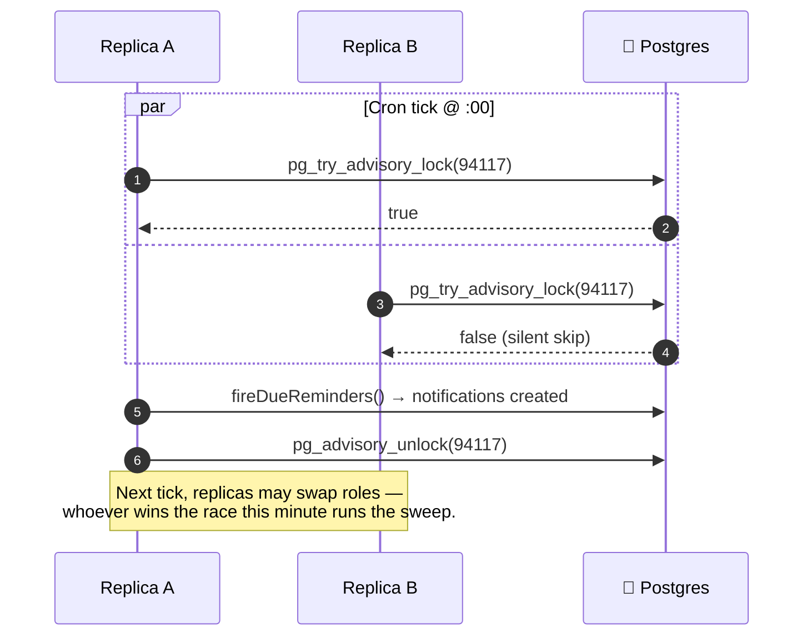

### Public surface of `ReminderService`

```ts
interface ReminderService {
  scheduleReminder(params: {
    kind: 'payment_unpaid' | 'repair_assignment_pending' | 'repair_in_progress_stuck';
    targetType: string;
    targetId: string;
    recipientUserIds: string[];      // deduped, falsy stripped
    notificationType: string;
    title: string;
    body: string;
    metadata?: Record<string, any>;
    intervalMs: number;
    maxFires: number;
    firstFireAt?: Date;               // default now + intervalMs
  }): Promise<ReminderJobEntity>;    // dedupes on (kind, targetType, targetId, status='active')

  cancelReminder(
    targetType: string,
    targetId: string,
    reason: string,
    kinds?: ReminderKind[],           // optional filter
  ): Promise<number>;                 // count of jobs flipped to 'cancelled'

  fireDueReminders(): Promise<void>;  // called by ReminderSweepService only
}
```

---

## 11. Deployment Topology

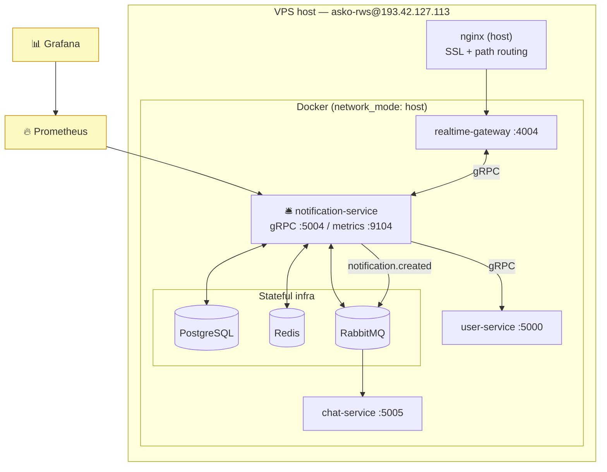

**Dockerfile notes:** one Dockerfile per app, minimal builds via `turbo prune @asko/notification-service --docker`. The service runs as a long-lived NestJS microservice (no HTTP listener beyond the metrics server) with both gRPC and RMQ transports attached via `app.connectMicroservice()`.

---

## 12. Configuration

All env vars are loaded through `@asko/shared`'s `getEnvFilePath()` helper (resolves `.env.prod` / `.env.dev` or falls back to `process.env`).

### Core

| Variable              | Default                  | Description                                   |
|-----------------------|--------------------------|-----------------------------------------------|
| `PORT`                | `4100`                   | Unused (kept for parity)                      |
| `GRPC_PORT`           | `5004`                   | gRPC microservice port                        |
| `METRICS_PORT`        | `9104`                   | Prometheus HTTP metrics port                  |
| `DATABASE_HOST`       | *required*               | Postgres host                                 |
| `DATABASE_PORT`       | *required*               | Postgres port                                 |
| `DATABASE_DB_NAME`    | `asko_rws_notify_db`     | Database name                                 |
| `DATABASE_USER`       | *required*               | DB user                                       |
| `DATABASE_PASS`       | *required*               | DB password                                   |
| `RABBITMQ_URL`        | `amqp://localhost:5672`  | RMQ connection string                         |
| `REDIS_URL`           | `redis://localhost:6379` | Redis for pub/sub + BullMQ                    |
| `USER_SERVICE_ADDR`   | `localhost:5000`         | gRPC target for `UserClientService`           |
| `EMAIL_HOST`          | `smtp.gmail.com`         | SMTP host                                     |
| `EMAIL_SMTP_PORT`     | `587`                    | SMTP port (secure mode if `465`)              |
| `EMAIL_AUTH_USER`     | *required*               | SMTP user                                     |
| `EMAIL_AUTH_PASS`     | *required*               | SMTP password                                 |
| `EMAIL_FROM`          | *required*               | Default `from` address for outbound mail      |

### Reminder watchdog (§10)

| Variable                                | Default      | Description                                                              |
|-----------------------------------------|--------------|--------------------------------------------------------------------------|
| `REMINDER_PAYMENT_INTERVAL_MS`          | `1800000`    | Payment-unpaid reminder interval (30 min)                                |
| `REMINDER_PAYMENT_MAX_FIRES`            | `3`          | Max times a payment-unpaid reminder nags                                 |
| `REMINDER_REPAIR_ASSIGNMENT_INTERVAL_MS`| `900000`     | Repair-assignment reminder interval (15 min)                             |
| `REMINDER_REPAIR_ASSIGNMENT_MAX_FIRES`  | `3`          | Max times an assignment reminder nags                                    |
| `REMINDER_REPAIR_STUCK_AFTER_MS`        | `28800000`   | `IN_PROGRESS` stuck threshold (8 h, fires once)                          |
| `REMINDER_SWEEP_CRON`                   | `* * * * *`  | Cron for `ReminderSweepService.sweep()` — read at class-decoration time  |
| `REMINDER_SWEEP_BATCH_SIZE`             | `100`        | Max due jobs per sweep tick                                              |
| `REMINDER_ADVISORY_LOCK_KEY`            | `94117`      | `pg_try_advisory_lock` key used to serialize sweeps across replicas      |

> `REMINDER_SWEEP_CRON` must be set **before** the NestJS module graph is constructed — it's baked into the `@Cron()` decorator. Restart the service after changing it.

---

## 13. Error Model

Domain errors live in `src/common/error/` and extend `@asko/shared`'s `AppError` registry. Codes start at **1100** to avoid collisions with other services.

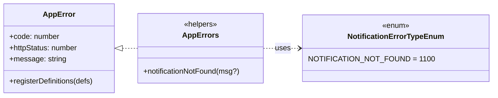

| Code | HTTP | Message                | Thrown from                                         |
|------|------|------------------------|-----------------------------------------------------|
| 1100 | 404  | `Notification not found` | `markAsRead()`, `deleteNotification()`            |

The gRPC controller converts any thrown `AppError` into an `RpcException` with the correct gRPC status (see §5).

---

## 14. Observability

- **Logging:** `@asko/observability`'s `PinoLogger` is wired in `main.ts` with service name `notification-service`.
- **Metrics:** A standalone HTTP server is started on `METRICS_PORT` via `createMetricsServer()` from `@asko/observability`. Default Node/Prometheus metrics are collected in the constructor (`collectDefaultMetrics()`).
- **Health:** There is no dedicated HTTP health endpoint — liveness is observed through RMQ consumer lag and metrics scraping.
- **Reminder sweep logs:** `ReminderService` logs `Sweep: N due reminder(s)` per non-empty tick, plus `Scheduled reminder <id>`, `Cancelled N reminder(s)`, `Reminder <id> exhausted`, and (debug) `Skipped user=<u> job=<id>: unread prior exists`. `ReminderSweepService` logs a warning when a sweep holds the advisory lock longer than **5000 ms**, which is the signal to investigate DB pressure or runaway batch sizes.

---

## 15. Notification & Target Type Catalog

All enums live in `@asko/shared` so every producer and consumer uses the same string literals.

### `NotificationType`

| Group      | Values                                                                                                                 |
|------------|------------------------------------------------------------------------------------------------------------------------|
| Repair     | `REPAIR_STATUS_CHANGED`, `REPAIR_ASSIGNED`, `REPAIR_COMPLETED`, `REPAIR_TRANSFERRED_TO_REPAIRER`, `REPAIR_TRANSFERRED_FROM_REPAIRER`, `REPAIR_TRANSFERRED_CLIENT`, `REPAIR_DIAGNOSTICS_DECLINED` |
| Payment    | `INVOICE_CREATED`, `PAYMENT_PAID`, `PAYMENT_FAILED`, `PAYMENT_REFUNDED`                                                 |
| Certificate| `CERTIFICATE_ISSUED`, `CERTIFICATE_EXPIRING_SOON`, `CERTIFICATE_EXPIRED`                                                |
| Chat       | `CHAT_MESSAGE`, `CHAT_CONVERSATION_CREATED`, `CHAT_PARTICIPANT_ADDED`, `CHAT_PARTICIPANT_REMOVED`                       |
| Schedule   | `SCHEDULE_CREATED`, `SCHEDULE_APPROVED`, `SCHEDULE_REJECTED`, `SCHEDULE_UPDATED`, `SCHEDULE_DELETED`, `SCHEDULE_EXTRA_DAY_REQUESTED`, `SCHEDULE_EXTRA_DAY_ACCEPTED`, `SCHEDULE_EXTRA_DAY_REJECTED`, `SCHEDULE_PATTERN_CREATED`, `SCHEDULE_PATTERN_UPDATED`, `SCHEDULE_PATTERN_DELETED`, `SCHEDULE_PATTERN_APPROVED`, `SCHEDULE_PATTERN_REJECTED` |
| Reminder   | `INVOICE_UNPAID_REMINDER`, `REPAIR_ASSIGNMENT_REMINDER`, `REPAIR_IN_PROGRESS_STUCK`                                    |
| Generic    | `MESSAGE`, `SYSTEM`                                                                                                    |

### `NotificationTargetType`

| Value            | Example target entity            |
|------------------|----------------------------------|
| `repairRequest`  | `RepairRequestEntity.id`         |
| `payment`        | `PaymentEntity.id`               |
| `certificate`    | `CertificateEntity.id`           |
| `conversation`   | `ConversationEntity.id`          |
| `schedule`       | `ScheduleEntity.id` / patternId  |
| `system`         | —                                |

---

## 16. Releases

A chronological log of user-visible changes. Entries are grouped by semantic version; each line links the change to a concrete file path so a reader can jump straight to the code.

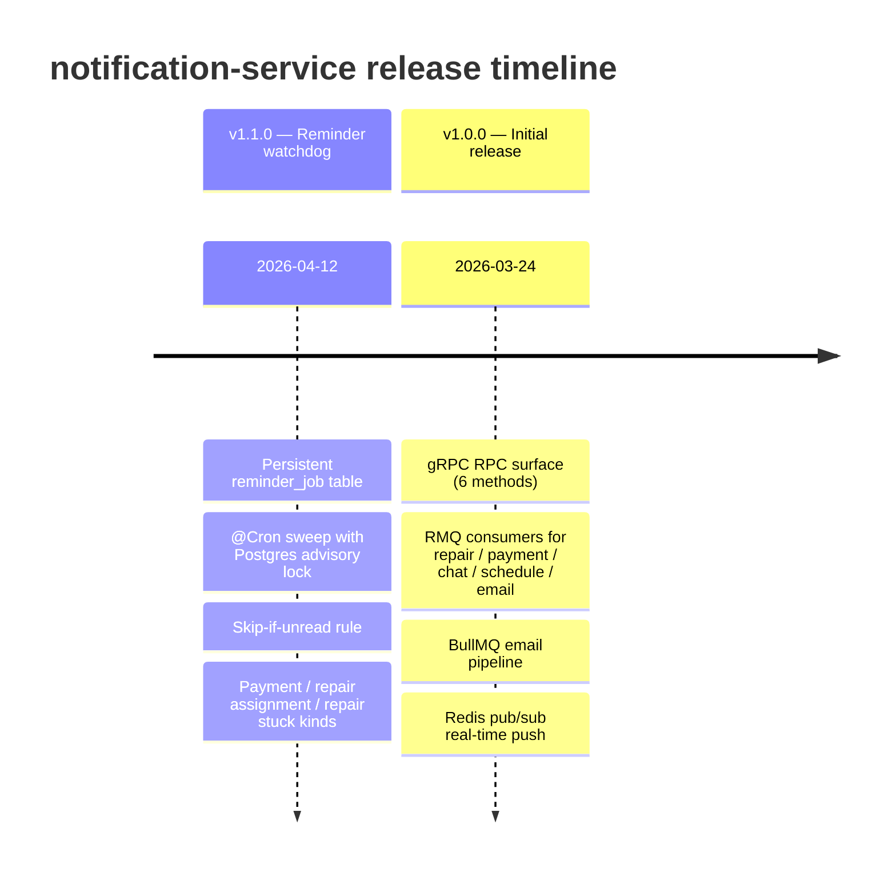

### v1.1.0 — Reminder Watchdog _(2026-04-12)_

Introduces a persistent, cron-swept reminder subsystem that re-fires notifications for actions the user hasn't completed, and stops automatically on terminal state transitions. See §10 for the full model.

**Added**
- Entity `ReminderJobEntity` with composite indexes for sweep, target lookup, and kind-scoped dedupe — `src/entities/reminder-job.entity.ts`.
- Migration `Migration20260412120000` creating `reminder_job` and the composite index `idx_notification_target_unread` on `notification` — `migrations/Migration20260412120000.ts`.
- `ReminderService.scheduleReminder / cancelReminder / fireDueReminders` with application-level dedupe and the skip-if-unread rule — `src/services/reminder.service.ts`.
- `ReminderSweepService` — `@Cron`-decorated sweep wrapped in `pg_try_advisory_lock(94117)` for multi-replica safety — `src/services/reminder-sweep.service.ts`.
- `NotificationService.hasUnreadForTarget(userId, targetType, targetId)` — backing query for the skip-if-unread rule, indexed by `idx_notification_target_unread` — `src/services/notification.service.ts`.
- Three new `NotificationType` enum values in `@asko/shared`: `INVOICE_UNPAID_REMINDER`, `REPAIR_ASSIGNMENT_REMINDER`, `REPAIR_IN_PROGRESS_STUCK`.
- Eight new env vars under `AppConfig.reminders.*` — see §12.
- Unit tests: `reminder.service.spec.ts` (14 specs) + `hasUnreadForTarget` cases in `notification.service.spec.ts`.

**Changed**
- `PaymentEventConsumer` now **schedules** a `payment_unpaid` reminder on `payment.created` and **cancels** it on `payment.paid` / `.failed` / `.refunded` — `src/consumers/payment-event.consumer.ts`.
- `RepairEventConsumer` now:
  - Schedules `repair_assignment_pending` on `repair.assigned`.
  - Schedules `repair_in_progress_stuck` (repairer + all ADMIN/MANAGER/SUPER_ADMIN staff) when `status_changed → in_progress`.
  - Cancels `repair_assignment_pending` when leaving `assigned` and `repair_in_progress_stuck` when leaving `in_progress`.
  - Cancels both kinds on `repair.completed`.
  - Reschedules `repair_assignment_pending` for the new repairer on `repair.transferred`.
  - `src/consumers/repair-event.consumer.ts`
- `RepairEvent` (in `apps/repair-service/src/modules/repair-event.service.ts`) gained `repairerUserId?: string` and `managerId?: string`; populated by `assignRepairer()` and `startWork()` in `apps/repair-service/src/services/repair-request.service.ts` so the notification-service can resolve reminder recipients without a new gRPC hop.
- `AppModule` now imports `ScheduleModule.forRoot()` and registers `ReminderJobEntity` with `MikroOrmModule.forFeature([...])`; `ReminderService` and `ReminderSweepService` join the providers list — `src/app.module.ts`.
- `NotificationEntity` gained the composite index `idx_notification_target_unread` on `(target_type, target_id, is_read)` — `src/entities/notification.entity.ts`.

**Dependencies**
- `@nestjs/schedule ^5.0.1` — matches the version used by `payment-service` and `user-service`.

**Operational notes**
- Manual step before deploy: `pnpm --filter @asko/shared run build` (Turbo dev filter excludes `@asko/shared` from watch).
- Run `./scripts/migrate-dev.sh notification-service` to apply `Migration20260412120000`.
- Default sweep cron is `* * * * *` (every minute). For faster local iteration, override via `REMINDER_SWEEP_CRON=*/10 * * * * *` in `.env.dev`.
- Multi-replica rollouts are safe as long as all replicas point at the same database (the advisory lock serializes sweeps).

### v1.0.0 — Initial release _(2026-03-24)_

First production cut of the service.

**Added**
- gRPC RPC surface: `CreateNotification`, `ListUserNotifications`, `MarkAsRead`, `MarkAllAsRead`, `GetUnreadCount`, `DeleteNotification` — `src/controllers/notification.grpc.controller.ts`.
- MikroORM entity `NotificationEntity` with migration `Migration20260324123852` — `src/entities/notification.entity.ts`, `migrations/Migration20260324123852.ts`.
- RMQ consumers for `repair.*`, `certificate.*`, `payment.*`, `chat.*`, `schedule.*`, `email.send` — `src/consumers/`.
- Real-time push via Redis pub/sub on the `notifications:push` channel — `src/services/notification-push.service.ts`.
- `NotificationEventPublisher` emits `notification.created` back to `chat_queue` so chat-service can sync message read state — `src/services/notification-event.publisher.ts`.
- BullMQ-backed email pipeline (`email` queue): `EmailEventConsumer` → `EmailProcessor` → `EmailTransportService` (nodemailer) — `src/consumers/email-event.consumer.ts`, `src/services/email.processor.ts`, `src/services/email-transport.service.ts`.
- Prometheus metrics endpoint via `@asko/observability` — default `METRICS_PORT=9104`.
- Domain error registry starting at code `1100` (`NOTIFICATION_NOT_FOUND`) — `src/common/error/`.

---

## Source Map

| Responsibility        | File                                                             |
|-----------------------|------------------------------------------------------------------|
| Bootstrap             | `src/main.ts`                                                    |
| Root module wiring    | `src/app.module.ts`                                              |
| Config                | `src/app.config.ts`                                              |
| Notification entity   | `src/entities/notification.entity.ts`                            |
| Reminder entity       | `src/entities/reminder-job.entity.ts`                            |
| Migration (v1.0.0)    | `migrations/Migration20260324123852.ts`                          |
| Migration (v1.1.0)    | `migrations/Migration20260412120000.ts`                          |
| gRPC controller       | `src/controllers/notification.grpc.controller.ts`                |
| Core service          | `src/services/notification.service.ts`                           |
| Reminder service      | `src/services/reminder.service.ts`                               |
| Reminder sweep        | `src/services/reminder-sweep.service.ts`                         |
| Push (Redis)          | `src/services/notification-push.service.ts`                      |
| RMQ publisher         | `src/services/notification-event.publisher.ts`                   |
| SMTP transport        | `src/services/email-transport.service.ts`                        |
| BullMQ worker         | `src/services/email.processor.ts`                                |
| Repair consumer       | `src/consumers/repair-event.consumer.ts`                         |
| Payment consumer      | `src/consumers/payment-event.consumer.ts`                        |
| Chat consumer         | `src/consumers/chat-event.consumer.ts`                           |
| Schedule consumer     | `src/consumers/schedule-event.consumer.ts`                       |
| Email consumer        | `src/consumers/email-event.consumer.ts`                          |
| Database module       | `src/modules/database.module.ts`                                 |
| Email queue module    | `src/modules/email-queue.module.ts`                              |
| User gRPC client      | `src/modules/user-client/user-client.{module,service}.ts`        |
| Errors                | `src/common/error/{definition,error-type.enum,eval,index}.ts`    |
| Email job interface   | `src/common/email-job.interface.ts`                              |
| Notification spec     | `src/services/notification.service.spec.ts`                      |
| Reminder spec         | `src/services/reminder.service.spec.ts`                          |
