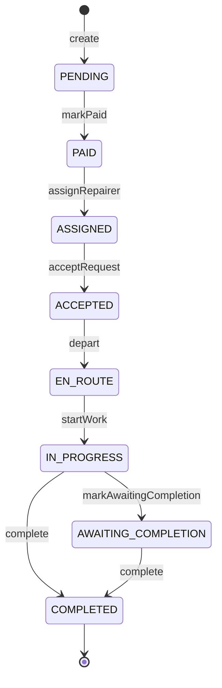
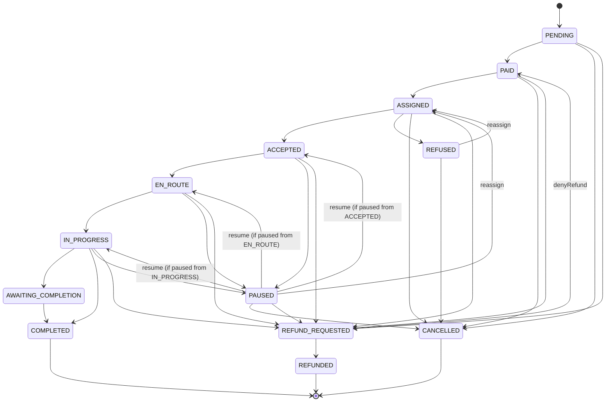
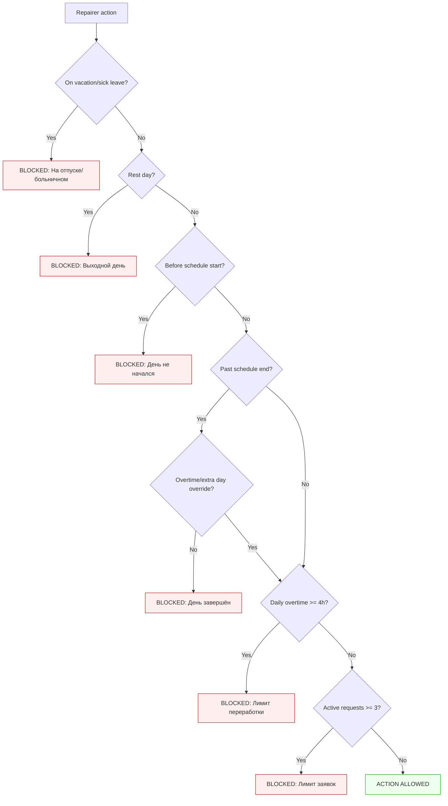
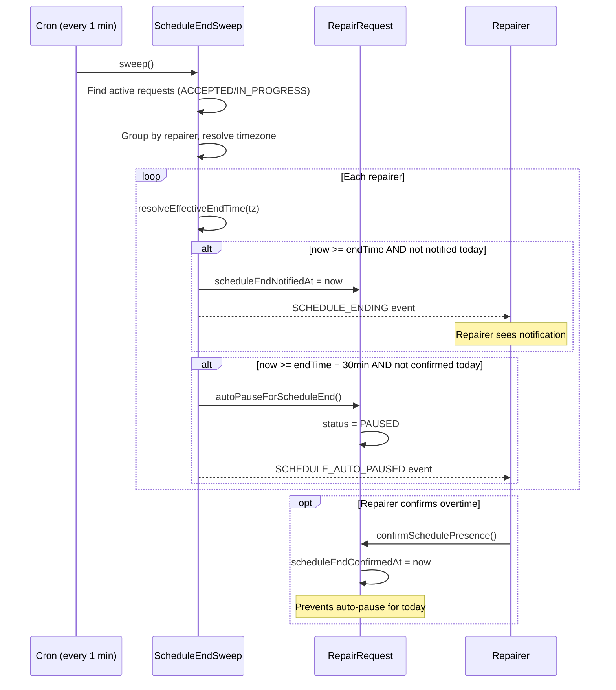
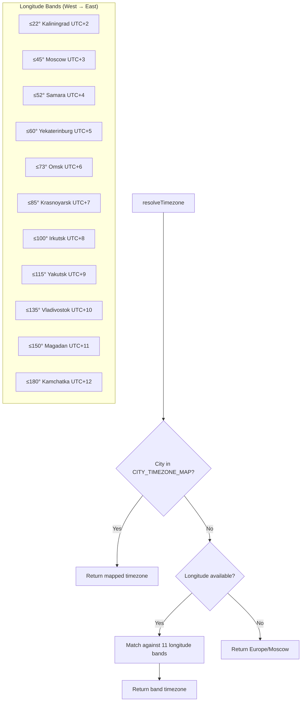
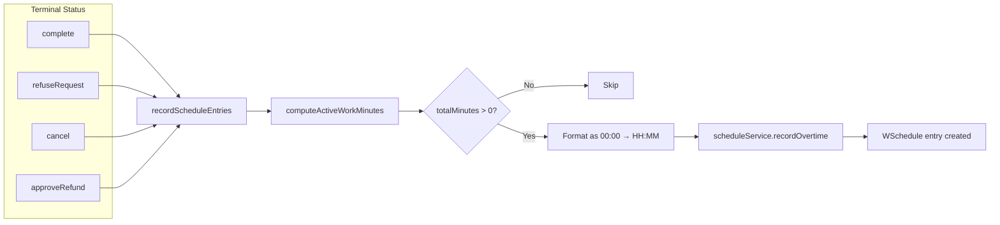

# Repair Request Architecture

Internal architecture of the repair request lifecycle, schedule enforcement, overtime tracking, timezone handling, and completion metrics.

**Related docs:**
- [Schedule System](./schedule.md) — work patterns, entries, overtime/extra-day entries
- [Repair Service README](../README.md) — service overview
- [Top-level docs index](../../../docs/README.md)

## Status Flow

### Happy Path



### Full State Machine



### Transition Rules

| Target | Allowed from |
|---|---|
| PAID | PENDING |
| ASSIGNED | Any except CANCELLED, COMPLETED, AWAITING_COMPLETION, REFUND_REQUESTED, REFUNDED |
| ACCEPTED | ASSIGNED |
| EN_ROUTE | ACCEPTED |
| IN_PROGRESS | EN_ROUTE |
| PAUSED | ACCEPTED, EN_ROUTE, IN_PROGRESS |
| AWAITING_COMPLETION | IN_PROGRESS |
| COMPLETED | IN_PROGRESS, AWAITING_COMPLETION |
| REFUND_REQUESTED | Any except COMPLETED, REFUNDED |
| REFUNDED | REFUND_REQUESTED |
| CANCELLED | Any except COMPLETED, EN_ROUTE, IN_PROGRESS, AWAITING_COMPLETION |

Action-based transitions:

| Action | From | To |
|---|---|---|
| refuse | ASSIGNED | REFUSED |
| denyRefund | REFUND_REQUESTED | PAID |
| resume | PAUSED | statusBeforePause |
| reassign | Any with repairer (except PENDING, PAID, COMPLETED, CANCELLED, REFUNDED, REFUND_REQUESTED) | ASSIGNED |

Source: `apps/repair-service/src/common/repair-request-state-machine.ts`

---

## Schedule Guards

Every repairer action passes through `assertScheduleAllows()` which runs 6 checks in sequence. If any check fails, the action is rejected with a descriptive Russian error message.

> Terminology: "pattern", "slot", "vacation", "sick_leave", "overtime", "extra_day" are all defined in the [Schedule System](./schedule.md) doc.

### Guard Flow



### Guard Checks (in order)

| # | Check | Blocks when | Error |
|---|---|---|---|
| 1 | Vacation / sick leave | Approved leave entry covers today | "Мастер на отпуске/больничном" |
| 2 | Rest day | Pattern slot `work: false` for today | "Сегодня выходной день мастера" |
| 3 | Before schedule start | Current local time < `slot.startTime` | "Рабочий день ещё не начался (начало в HH:MM)" |
| 4 | After schedule end | Current local time > `slot.endTime` and no approved overtime/extra_day extends it | "Рабочий день завершён (окончание в HH:MM)" |
| 5 | Daily overtime cap | Today's overtime entries >= 4 hours | "Превышен лимит переработки (4ч/день)" |
| 6 | Concurrent request limit | Active requests >= 3 | "У мастера N активных заявок (лимит: 3)" |

### Where Guards Apply

| Method | assertScheduleAllows | assertEnoughScheduleTime |
|---|---|---|
| `assignRepairer()` | Yes | Yes (blocks if < 30 min remaining) |
| `reassign()` | Yes | Yes |
| `acceptRequest()` | Yes | - |
| `depart()` | Yes | - |
| `startWork()` | Yes | - |
| `resume()` | Yes | - |
| `confirmSchedulePresence()` | Custom (vacation/sick/rest + overtime cap only) | - |
| `complete()` | - | - |
| `pause()` | - | - |
| `cancel()` | - | - |

### Constants

```
MAX_OVERTIME_MINUTES_PER_DAY  = 240  (4 hours)
MAX_CONCURRENT_ACTIVE_REQUESTS = 3
MIN_REMAINING_SCHEDULE_MINUTES = 30
```

Source: `apps/repair-service/src/services/repair-request.service.ts`

---

## Schedule End Auto-Pause

A cron job runs **every minute**, finds active requests (ACCEPTED / IN_PROGRESS), and enforces schedule end times per-repairer.

### Auto-Pause Flow



### Two-Phase System

**Phase 1 — Notification** (at schedule end time):
- Sets `scheduleEndNotifiedAt` on the request
- Emits `SCHEDULE_ENDING` event (triggers frontend notification to repairer)
- Repairer can call `confirmSchedulePresence()` to acknowledge overtime

**Phase 2 — Auto-Pause** (30 min after schedule end):
- If `scheduleEndConfirmedAt` is not set for today, auto-pauses the request
- Sets status to PAUSED with `statusBeforePause` preserved
- Emits `SCHEDULE_AUTO_PAUSED` event

### End Time Resolution Priority

1. Approved OVERTIME / EXTRA_DAY entries for today — take latest `endTime`
2. Pattern slot for today — use `slot.endTime`
3. Vacation / sick leave — return null (repairer is off, skip)

Source: `apps/repair-service/src/services/schedule-end-sweep.service.ts`

---

## Timezone System

All schedule comparisons use timezone-aware time derived from the repairer's IANA timezone (e.g., `Asia/Vladivostok`). Pattern times (HH:MM) are stored as repairer-local; conversion happens at comparison time.

### Timezone Resolution



Priority: explicit city name → longitude band → default (`Europe/Moscow`)

- **City map**: 50+ Russian cities with explicit IANA timezone overrides
- **Longitude bands**: 11 bands covering Russia's full east-west span
- **Default fallback**: `Europe/Moscow` when no timezone is set

### How it works

```
getLocalNow('Asia/Vladivostok')
→ { nowTime: '19:30', todayStart: <UTC Date for midnight Vladivostok>, todayEnd: ... }
```

Uses `Intl.DateTimeFormat.formatToParts()` — no external dependencies. Russia abolished DST in 2014, so all timezones have fixed UTC offsets.

### Timezone Population

| Entity | When set |
|---|---|
| Repairer | On create (from city), on city update, on location update (from lon) |
| Address | On create (from city/lon), on location update, refined after Nominatim validation |

### Key Files

- `apps/repair-service/src/common/timezone.ts` — `getLocalNow()`, `getLocalDateAsUtc()`, `DEFAULT_TIMEZONE`
- `apps/repair-service/src/common/timezone-lookup.ts` — city/coord → IANA timezone mapping

---

## Status Timestamps

Every status transition appends to the `statusTimestamps` JSONB array on the request:

```json
[
  { "status": "pending",     "timestamp": "2026-04-15T10:00:00.000Z" },
  { "status": "paid",        "timestamp": "2026-04-15T10:05:00.000Z" },
  { "status": "assigned",    "timestamp": "2026-04-15T10:30:00.000Z" },
  { "status": "accepted",    "timestamp": "2026-04-15T10:45:00.000Z" },
  { "status": "en_route",    "timestamp": "2026-04-15T11:00:00.000Z" },
  { "status": "in_progress", "timestamp": "2026-04-15T11:30:00.000Z" },
  { "status": "paused",      "timestamp": "2026-04-15T13:00:00.000Z" },
  { "status": "in_progress", "timestamp": "2026-04-15T14:00:00.000Z" },
  { "status": "completed",   "timestamp": "2026-04-15T17:30:00.000Z" }
]
```

Unlike a `Record<string, string>`, this array keeps ALL transitions including repeat statuses (pause/resume cycles). Entries are always appended chronologically.

### Uses

1. **Active work time calculation** — sum time in `EN_ROUTE` + `IN_PROGRESS`, excluding pauses
2. **Overtime recording** — total active work minutes saved as schedule overtime entry on terminal status
3. **Completion metrics** — average durations per lifecycle phase
4. **Status history modal** — frontend timeline visualization

---

## Overtime Tracking

When a request reaches any terminal status (COMPLETED, REFUSED, CANCELLED, REFUNDED), the system records the total active work time as a schedule overtime entry.

### Overtime Recording Flow



### Active Work Statuses

Only `EN_ROUTE` and `IN_PROGRESS` count as active work. All other statuses (PAUSED, ACCEPTED, AWAITING_COMPLETION, etc.) are excluded.

### Calculation

```mermaid
gantt
    title Active Work Time Calculation Example
    dateFormat HH:mm
    axisFormat %H:%M

    section Status Timeline
    EN_ROUTE        :active, 11:00, 30min
    IN_PROGRESS     :active, 11:30, 90min
    PAUSED          :done,   13:00, 60min
    IN_PROGRESS     :active, 14:00, 210min
    COMPLETED       :milestone, 17:30, 0min

    section Active Work
    Active (330 min) :crit, 11:00, 330min
```



`computeActiveWorkMinutes()` walks the `statusTimestamps` array:

```
EN_ROUTE  (11:00) ──► IN_PROGRESS (11:30) ──► PAUSED (13:00) ──► IN_PROGRESS (14:00) ──► COMPLETED (17:30)
│                      │                       │                   │                       │
└──── 30 min ──────────┘                       │                   └──── 210 min ──────────┘
                                               │
                                          excluded (1h pause)

Total active = 30 + 90 + 210 = 330 min = 5h 30m
         (EN_ROUTE: 30min, IN_PROGRESS: 90 + 210 = 300min)
```

### Storage

Overtime is stored as a WSchedule entry:
- `type: OVERTIME`
- `startTime: '00:00'`
- `endTime: 'HH:MM'` (total minutes formatted)
- `autoGenerated: true`
- `status: APPROVED`
- `note: 'Авто: заявка #XXXXXXXX'`

The report service calculates `overtimeTotalMinutes` as `endTime - startTime`, giving the correct total.

---

## Completion Metrics

`GET /repair-requests/metrics/completion?dateFrom=YYYY-MM-DD&dateTo=YYYY-MM-DD`

Restricted to admin/manager roles. Queries all terminal requests in the date range and computes averages.

### Metrics

| Field | Description | Source |
|---|---|---|
| `totalTerminal` | Total requests that reached terminal status | Count |
| `completedCount` | Completed requests | Count |
| `cancelledCount` | Cancelled requests | Count |
| `refusedCount` | Refused requests | Count |
| `refundedCount` | Refunded requests | Count |
| `avgTotalMinutes` | Average wall-clock time (first → last status) | statusTimestamps first/last |
| `avgActiveWorkMinutes` | Average active work time (EN_ROUTE + IN_PROGRESS) | `computeActiveWorkMinutes()` |
| `avgAssignmentMinutes` | Average time to assign (PENDING/PAID → ASSIGNED) | `computeFirstTransitionMinutes()` |
| `avgResponseMinutes` | Average response time (ASSIGNED → ACCEPTED) | `computeFirstTransitionMinutes()` |
| `avgTravelMinutes` | Average travel time (total EN_ROUTE duration) | `computeStatusMinutes()` |
| `avgRepairMinutes` | Average repair time (total IN_PROGRESS duration) | `computeStatusMinutes()` |

All averages exclude requests without data for that metric (e.g., cancelled requests without EN_ROUTE won't affect `avgTravelMinutes`).

Source: `apps/repair-service/src/services/repair-request.service.ts` — `getCompletionMetrics()`

---

## Pattern Change Guards

Schedule pattern modifications are guarded when the repairer has active requests:

| Action | Guard |
|---|---|
| Delete pattern | Blocked if repairer has active requests |
| Approve pattern (when today becomes rest day) | Blocked if repairer has active requests |

Source: `apps/repair-service/src/services/wschedule-pattern.service.ts`

---

## Key Files

| File | Purpose |
|---|---|
| `repair-service/src/common/repair-request-state-machine.ts` | Status transition validation |
| `repair-service/src/common/timezone.ts` | `getLocalNow()`, `getLocalDateAsUtc()` |
| `repair-service/src/common/timezone-lookup.ts` | City/coord → IANA timezone |
| `repair-service/src/entities/repair-request.entity.ts` | RepairRequest entity (all fields) |
| `repair-service/src/services/repair-request.service.ts` | Lifecycle methods, schedule guards, overtime tracking, metrics |
| `repair-service/src/services/schedule-end-sweep.service.ts` | Cron-based auto-pause after schedule end |
| `repair-service/src/services/wschedule.service.ts` | WSchedule CRUD (overtime/extra day entries) |
| `repair-service/src/services/wschedule-pattern.service.ts` | Pattern resolution, cycle position, pattern change guards |
| `repair-service/src/services/wschedule-report.service.ts` | Aggregate schedule report generation |
