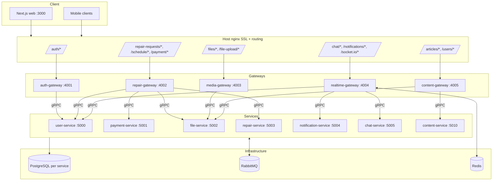

# Architecture Overview

High-level architecture of the ASKO repair management platform. For domain-specific details see the [docs index](./README.md).

## Topology

## Communication Patterns

- **REST + WebSocket**: web/mobile ↔ gateways
- **gRPC**: gateways ↔ services (synchronous)
- **RabbitMQ**: cross-service events (asynchronous — payments, notifications, file uploads, schedule events)

## Service Ownership

Each microservice owns its own PostgreSQL database. No cross-service table access. Cross-domain data flows through gRPC or RabbitMQ only.

| Service | Owns |
|---|---|
| user-service | Users, auth, invitations, sessions, OAuth, MFA |
| payment-service | Payments, providers, refunds |
| file-service | File uploads, images, video processing, access control |
| **repair-service** | **Repair requests, devices, certificates, repairers, schedules, AVR** ([docs](../apps/repair-service/README.md)) |
| notification-service | Notifications, email (BullMQ) |
| chat-service | Conversations, messages, presence |
| content-service | Articles (Lexical JSON), view analytics |

## Frontend

Single Next.js app (`apps/web`). One domain — nginx routes different URL prefixes to different gateways, so the frontend sees one origin.

## Shared Packages

- `@asko/proto` — .proto files + TS interfaces (no build step)
- `@asko/shared` — DTOs, enums, AppError system, shared utilities
- `@asko/ui` — React components
- `@asko/observability` — Prometheus metrics + Pino logger
- `@asko/gateway-common` — shared gateway infra (guards, decorators, filters, gRPC utils)

See [CLAUDE.md](../CLAUDE.md) for detailed conventions.
